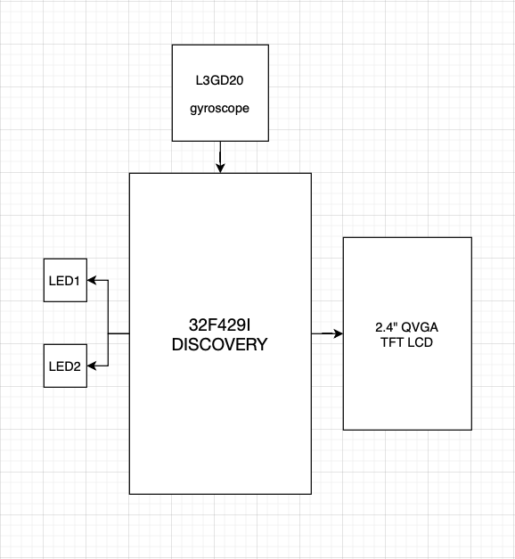

<b>Project Proposal</b>

<b>Group Members</b>
	<ul>
	<li>Jacob Sorenson</li> 
	<li>Jared Knight</li>
	</ul>

<b>High-level Description</b>

A handheld game which uses a screen to display a ball that is able to roll around. By tilting the device the user is able to control the velocity and direction of the ball. The objective of this game is to move the ball into target locations which will appear as previous targets are reached. The red LED (level 1) will begin blinking slowly, increasing in frequency as targets are hit until it locks in solid, moving onto the next level (green). Once the green LED locks in,  the game is won. If the user hits a wall the LEDs will be reset to the previous locked level.

<b>Functional Block Diagram</b>

<b>Milestones</b>
	<ul>
	<li>Milestone 1: Get board needed for project. Initialize gyroscope to get x and y values.</li>
	<li>Milestone 2: Create images (backgrounds with targets and ball) needed to display. Display layer 1 (background with targets) and layer 2 (ball) images.</li>
	<li>Milestone 3: Update ball position from gyroscope x and y data.</li>
	<li>Milestone 4: Trigger LED when target is met. Display winning screen.</li>
	</ul>

